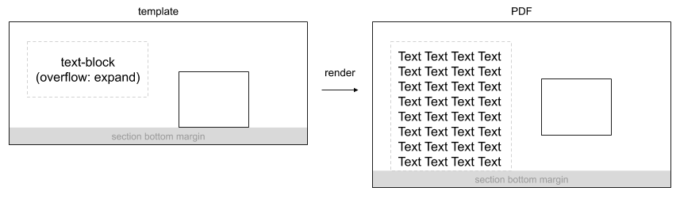
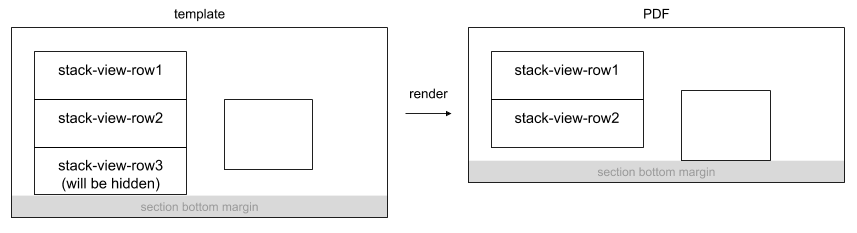

# Section Auto Stretch

By enabling auto-stretch, the height of the section can be automatically stretched according to the content after drawing.

- [Example code](test_feature.rb)
- [Example template file](template.tlf)
- [Example PDF](expect.pdf)

## Calculating the height when stretching

### Bottom margin and bottom position of content

The height of the section after it is stretched is determined by the bottom margin and the bottom position of the content.

Bottom Position of Content

- The bottom position of the item in the section (except for items for which "Affect bottom margin" is disabled)
- Varies depending on the drawing result

Bottom Margin

- The height or area between the bottom position of the content and the bottom position of the section
- Determined and fixed by the content of the template definition

See [Section Bottom Margin](../section_report_section_bottom_margin/README.md) for details.

### Calculating the height

The height of the section is defined as follows:

```
height of section = bottom of content + height of bottom margin
```

When an item such as text-block or stack-view is stretched, the bottom position of the content may change, and if auto-stretch of the section is enabled, the height of the section will be changed based on the changed bottom position of the content.

## Expanding the height

Expanding the height occurs in the following cases:

- When the height of the text-block after drawing becomes higher than the defined height, and as a result, the bottom position of the section content becomes larger
- When the height of stack-view becomes higher than the defined height, and as a result, the bottom position of the section content becomes larger

In these cases, the height of the section is expanded as follows:



## Shrinking the height

Shrinking the height occurs in the following cases:

- When the height of the stack-view becomes smaller than the defined height, and as a result, the bottom position of the section content becomes smaller
- When the image of an image-block whose vertical position is top becomes smaller than the height of the defined area, and as a result, the bottom position of the section content becomes smaller

In these cases, the height of the section is shrinked as follows:


