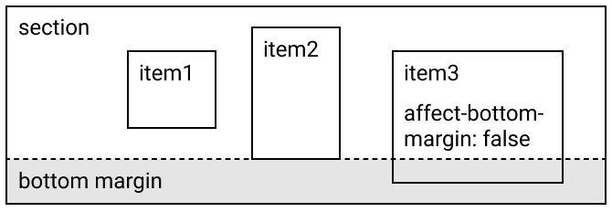

# Section Bottom Margin

section の下余白（bottom margin）とは、section のコンテンツの下位置と、section の下位置との間の距離である。

- [Example code](test_feature.rb)
- [Example template file](template.tlf)
- [Example PDF](expect.pdf)

「下余白に影響（affect-bottom-margin）」が無効の item は、下余白には影響しない。

上図の例の場合、item3 は「下余白に影響」が無効なので、下余白には影響しない。
item2 の下位置が「sectionのコンテンツの下位置」となるため、item2の下位置と section の下位置の間（グレーの網掛けの部分）が、この section の下余白となる。

section の自動伸縮が有効のときは、section の下余白を保った状態で section が自動的に伸縮する。詳細は [Section Auto Stretch](../section_report_section_auto_stretch/README.md) を参照
